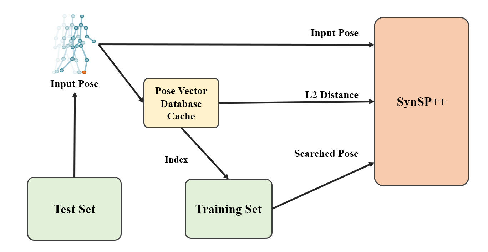
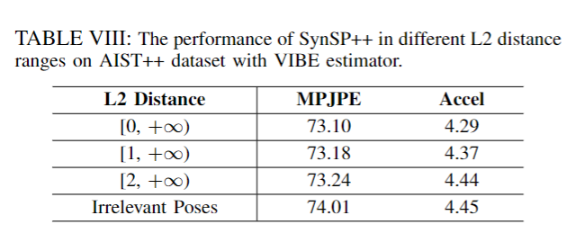
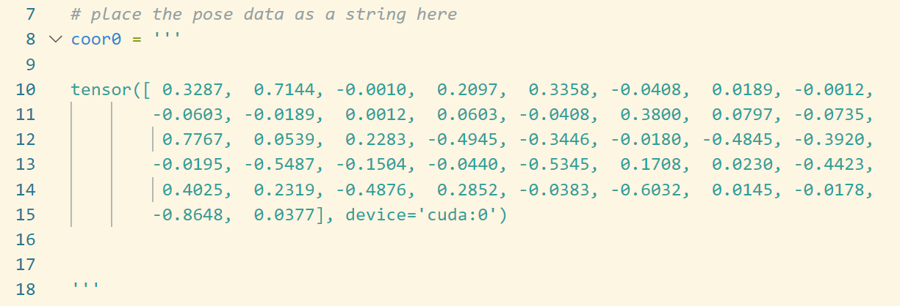
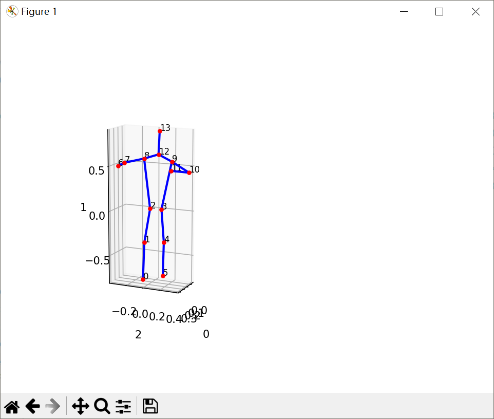

 # SynSP++: General Pose Sequences Refinement via Synergy of Smoothness and Precision

This is an implementation to test the performance of SynSP++, which specifically verifies the results in TABLE VIII of the paper, proving that the closer the searched pose is to the iput pose, the better the performance of SynSP++.


## Note
The code for fast testing is provided, but the process of setting up PVD (which is quite complex) will be provided later. We have cached the searched result (index for training set and the L2 distance) from PVD as shown in the **figure** below. We believe that this test is sufficient to demonstrate the effectiveness of SynSP++. If you have any questions, please feel free to contact wangtao@bupt.edu.cn.



## Getting Started

### Environment Requirement

```
pip install -r requirements.txt
```
In addition, 10G shared memory is required for high-performance.

### Prepare Data

All the data used in our experiment can be downloaded here. **data.tar** contains AIST++ dataset and need to be unzipped to the data directory. **29_checkpoint.pth.tar** is the model we trained with AIST++ dataset and VIBE estimator.

[Google Drive](https://drive.google.com/drive/folders/1jvpCEeME_98zCQm304Juf3tByu1Q39A1?usp=sharing)

The directory sructure of the repository should look like this:

```
.
|-- configs
|-- data
|   `-- poses
|       `-- aist_vibe_3D
|           |-- detected
|           |-- eval_search
|           |   |-- 0
|           |   |-- 1
|           |   `-- 2
|           `-- groundtruth
|-- lib
|   |-- core
|   |-- dataset
|   |-- models
|   |-- utils
|   `-- visualize
|-- model
`-- vis

```

### Prepare the data to shm
AIST++ dataset is so big that we need to put it in /dev/shm to reduce the speed of reading data and memory usage.

```
python ./lib/utils/stay_shm.py
```

### Evaluation

Run the commands below to start evaluation:

```
python eval_synsp++.py --cfg configs/h36m_fcn_3D.yaml --checkpoint /path/to/69_checkpoint.pth.tar --dataset_name aist --estimator vibe --body_representation 3D --slide_window_size 8 --tradition oneeuro
```
The results should be as follows:


### Visualization
By debugging in models/model_inf.py Line 336, You can visualize the poses  by send the string of pose data to 3dshow.py, here is an example of the visualization result:



